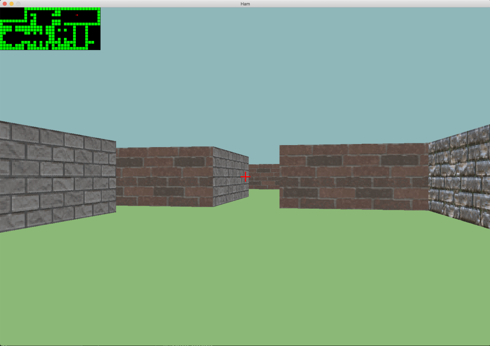
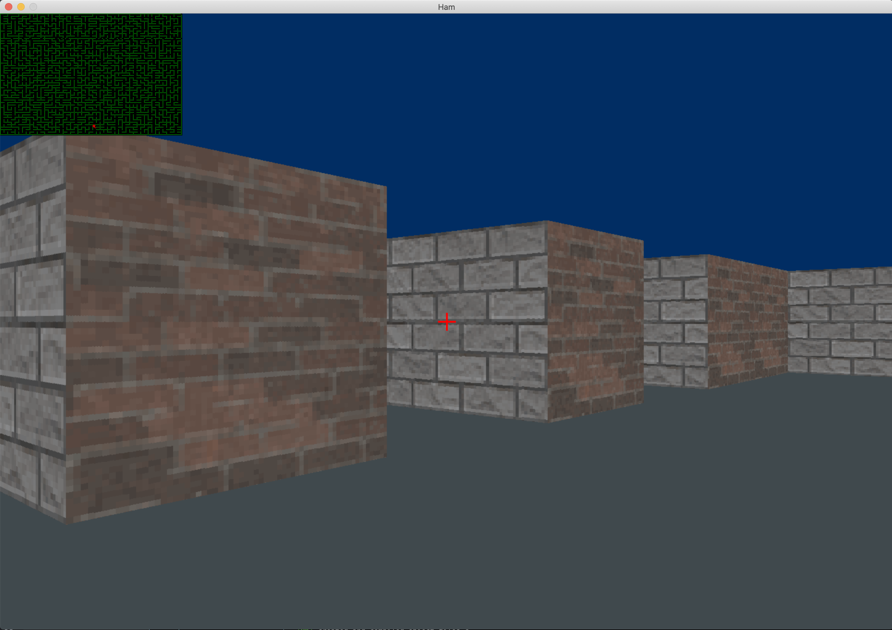

# Cub3d
this is the 42 project Cub3d coded with dferreir.

use make to have the mandotary part

use make bonus to have the bonus part including:
- mini map
- collision with walls
- mouse movement

